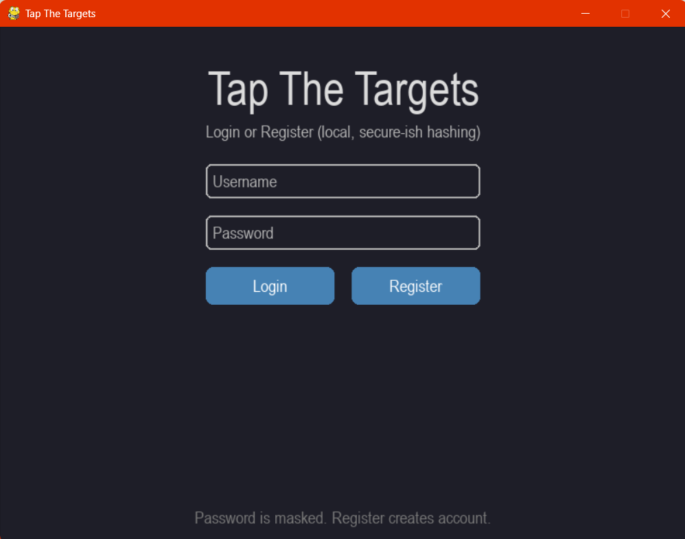
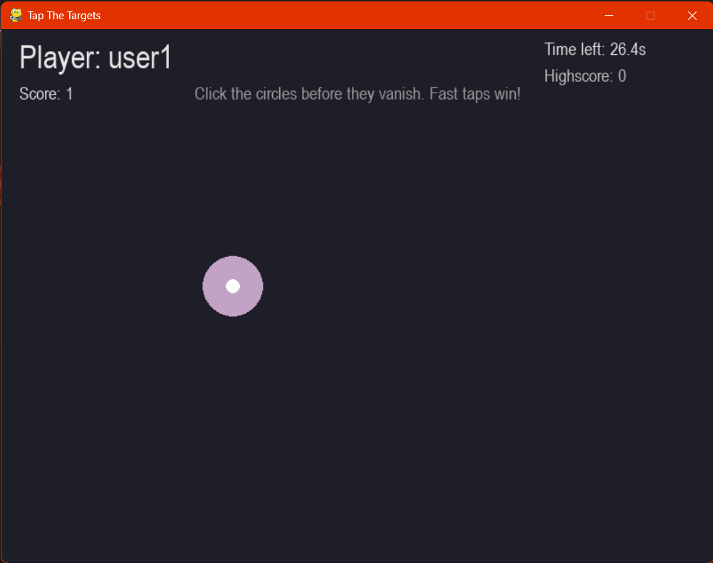
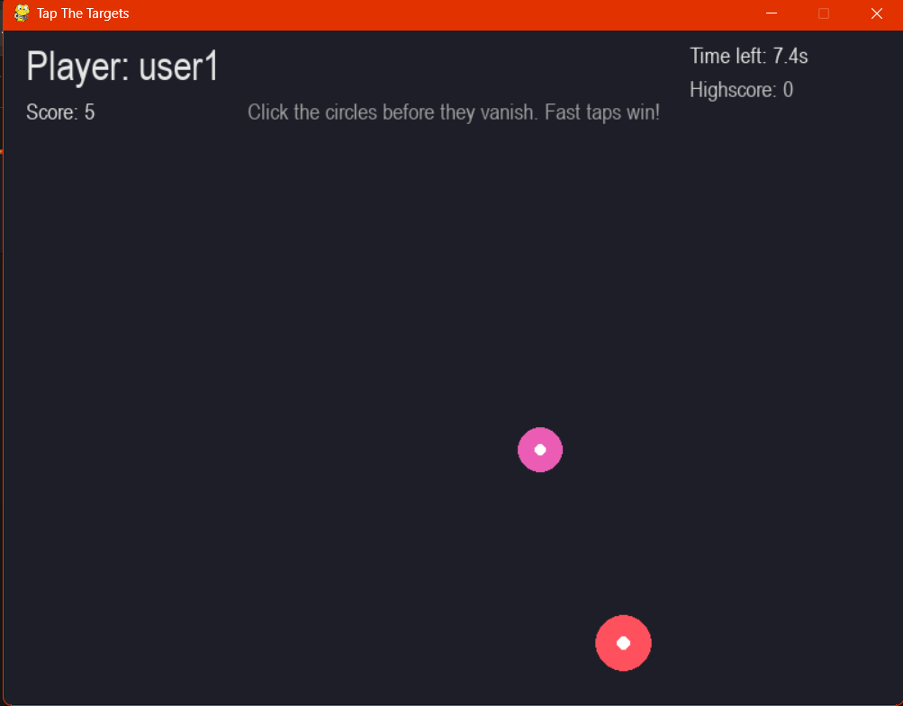
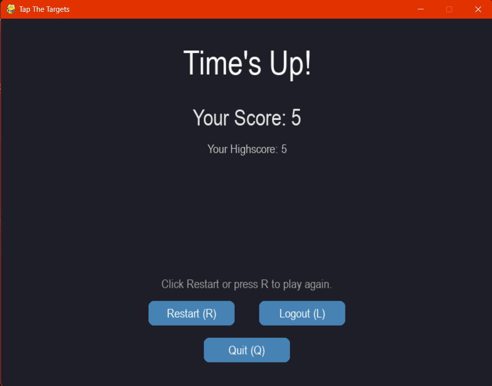

<p align="center">
  
</p>

> **IMPORTANT:** This software is developed for student learning and educational purposes only.

<h1 align="center">JS Tap-Tap</h1>

<p align="center">
  <strong>Team: Chip-X | Developer: Jayasubramani S</strong>
</p>

<p align="center">
  <strong>A fast, local, target-clicking arcade game.</strong>
</p>

<p align="center">
  <a href="LICENSE"></a>
  
  
  <a href="https://github.com/jayasubramani/js-tap-tap/releases/latest"></a>
  
</p>

---

JS Tap-Tap is a fast-paced, reflex-testing target clicking game developed by **Jayasubramani** under the **Chip-X / JS SoftTools** brand. Built as a portfolio project, it features a local authentication system, persistent highscores, and a standalone Windows installer.

## Table of Contents

- [Features](#features)
- [Screenshots](#screenshots)
- [Demo](#demo)
- [Installation](#installation)
- [Requirements](#requirements)
- [Usage / Controls](#usage--controls)
- [Project Structure](#project-structure)
- [Architecture](#architecture)
- [Building from Source](#building-from-source)
- [Roadmap](#roadmap)
- [FAQ](#faq)
- [Contributing](#contributing)
- [License](#license)
- [Developer](#developer)
- [Support](#support)
- [Acknowledgements](#acknowledgements)

---

## Features

- **30-second timed rounds** — Targets expire if not clicked quickly!
- **Local Authentication** — Register and login (SHA-256 + salt password hashing).
- **Persistent Highscores** — Your best score is saved locally between sessions.
- **Standalone EXE** — No Python installation required to play the game.
- **Windows Installer** — Quick one-click setup script to add Desktop and Start Menu shortcuts.

*See [docs/FEATURES.md](docs/FEATURES.md) for the full feature list.*

---

## Screenshots

<table align="center">
  <tr>
    <td></td>
    <td></td>
  </tr>
  <tr>
    <td align="center"><strong>Login / Register</strong></td>
    <td align="center"><strong>Mid-Round Action</strong></td>
  </tr>
  <tr>
    <td></td>
    <td></td>
  </tr>
  <tr>
    <td align="center"><strong>Time Running Out!</strong></td>
    <td align="center"><strong>Results & Highscore</strong></td>
  </tr>
</table>

*(Note: These are placeholders. Capture real screenshots as per `assets/screenshots/CAPTURE_GUIDE.md`)*

---

## Demo

<video src="https://raw.githubusercontent.com/jayamani2006/JS-Tap-Tap/main/assets/media/demo.mp4" controls autoplay muted loop width="100%"></video>

*(If the video doesn't load automatically, [click here to view it](assets/media/demo.mp4))*

---

## Installation

**Method 1: Installer (Recommended)**
1. Download `JS-Tap-Tap-Setup-vX.Y.Z.zip` from [Releases](https://github.com/jayasubramani/js-tap-tap/releases/latest).
2. Extract the ZIP.
3. Right-click `Install.bat` and **"Run as Administrator"**.
4. Launch from your Desktop shortcut!

**Method 2: Portable EXE**
1. Download `JS-Tap-Tap-Portable-vX.Y.Z.exe` from [Releases](https://github.com/jayasubramani/js-tap-tap/releases/latest).
2. Double-click to play instantly.

*See [INSTALL.md](INSTALL.md) for troubleshooting and uninstall instructions.*

---

## Requirements

- **OS:** Windows 10 or 11 (64-bit)
- **Dependencies:** None required for the game itself. 
  *(The post-install welcome popup requires Python + Pillow, but the game functions perfectly without them).*

---

## Usage / Controls

| Action | Input |
|---|---|
| Click a target | **Left Mouse Button** |
| Switch login fields | **Tab** |
| Submit login | **Enter** |
| Restart round | **R** |
| Logout | **L** |
| Quit | **Q** or Close Window |

*See [docs/USER_GUIDE.md](docs/USER_GUIDE.md) for full gameplay instructions.*

---

## Project Structure

<details>
<summary>Click to expand folder tree</summary>

```
js-tap-tap/
├── .github/          # GitHub templates and CI workflows
├── assets/           # Images, logos, and demo videos
├── docs/             # Documentation (architecture, guides, features)
├── installer/        # Install scripts (Install.bat, welcome.py)
├── packaging/        # PyInstaller build config
├── src/js_tap_tap/   # Main Python game package
│   ├── auth.py       # Authentication logic
│   ├── entities.py   # Game objects (Targets)
│   ├── main.py       # Entry point and state machine
│   ├── screens.py    # UI screens (login, game, results)
│   └── ui_widgets.py # Reusable UI components
├── tests/            # Unit tests
└── [Config Files]    # README, LICENSE, requirements.txt, etc.
```

</details>

---

## Architecture

JS Tap-Tap is built with Pygame and organised using modern Python modular design. 
- The game logic is split across distinct responsibilities (UI, Auth, Entities, Screens).
- A clean state machine manages transitions between Login → Game → Results.
- Authentication uses salted SHA-256 hashing for local credential persistence.

*Read the full technical breakdown in [docs/PROJECT_ARCHITECTURE.md](docs/PROJECT_ARCHITECTURE.md).*

---

## Building from Source

Want to tinker with the code? You can run it directly or build your own EXE.

1. Clone the repo and set up a venv (`python 3.11+`).
2. `pip install -r requirements.txt`
3. Run directly: `python -m src.js_tap_tap.main`
4. Build EXE: `pyinstaller packaging/game.spec`

*See [docs/BUILD.md](docs/BUILD.md) for detailed build instructions.*

---

## Roadmap

Upcoming features might include:
- Difficulty modes (Easy, Normal, Hard)
- Sound effects and visual click feedback
- Linux / macOS support

*See [ROADMAP.md](ROADMAP.md) for the full list of planned ideas.*

---

## FAQ

**Q: I clicked a target but didn't score?**  
A: Targets expire after exactly 1 second. You have to be fast!

**Q: Is my password safe?**  
A: Passwords are hashed with SHA-256 + salt locally. It's secure enough for a local standalone game, but is *not* a production-grade web auth system. See [SECURITY.md](SECURITY.md).

*Read more in [docs/FAQ.md](docs/FAQ.md).*

---

## Contributing

Contributions are welcome! Please read [CONTRIBUTING.md](CONTRIBUTING.md) for setup instructions and [CODE_OF_CONDUCT.md](CODE_OF_CONDUCT.md) for community guidelines.

---

## License

This project is licensed under the [MIT License](LICENSE).
Please note the [DISCLAIMER.md](DISCLAIMER.md) regarding the local authentication system.

---

## Developer

Developed by **Jayasubramani** under the brand **Chip-X / JS SoftTools**.

---

## Support

Found a bug or have a feature request? Please open an issue on the [GitHub Issues](https://github.com/jayasubramani/js-tap-tap/issues) page.

---

## Acknowledgements

- Built with [Pygame](https://www.pygame.org/)
- [Pillow](https://pillow.readthedocs.io/) used for popup image rendering

---

> **IMPORTANT:** This software is developed for student learning and educational purposes only. It is a portfolio project and not intended for commercial production use.
