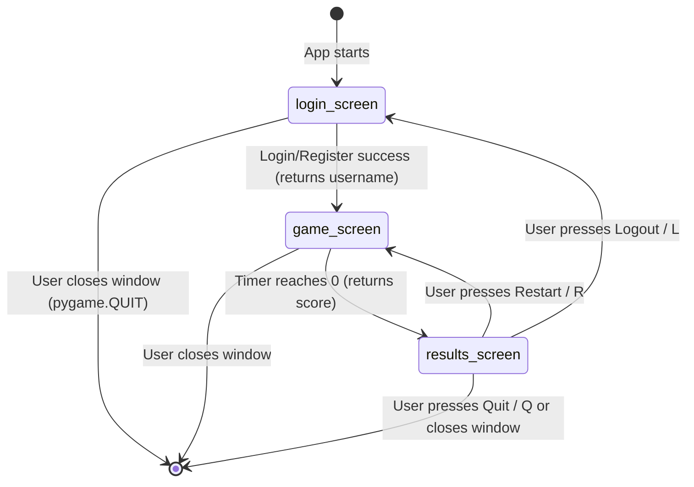

# Project Architecture — JS Tap-Tap

**Version:** 1.0.0  
**Language:** Python 3.11+  
**Framework:** Pygame 2.x  

This document describes the technical architecture of JS Tap-Tap after the v1.0.0
modularisation — covering module responsibilities, data flow, and the screen state
machine.

---

## Repository Structure

```
js-tap-tap/
├── src/js_tap_tap/         # Python package (the game)
│   ├── __init__.py         # Package marker, version string
│   ├── main.py             # Entry point, Pygame init, CONFIG, state machine loop
│   ├── auth.py             # All auth/persistence — NO Pygame dependency
│   ├── ui_widgets.py       # TextInput, Button — Pygame-rendering only, no logic
│   ├── entities.py         # Target class — game entity, no auth/UI
│   └── screens.py          # login_screen, game_screen, results_screen
├── installer/
│   ├── Install.bat         # Windows: copies EXE to Desktop + Start Menu shortcut
│   └── welcome.py          # Tkinter post-install popup (Python + Pillow required)
├── packaging/
│   └── game.spec           # PyInstaller spec: onefile, icon, entry point
├── tests/
│   └── test_auth.py        # Unit tests for auth.py (no Pygame needed)
├── assets/                 # All non-code binary media
├── docs/                   # Long-form documentation
└── .github/                # CI workflows and GitHub templates
```

---

## Module Responsibilities

### `auth.py` — Authentication & Persistence

**Single responsibility:** User data (load, save, hash, verify, highscore).  
**Dependencies:** `os`, `json`, `hashlib` — **zero** Pygame or UI imports.  
**Why isolated:** Enables unit testing without a display, and makes the security
model completely auditable without reading any game code.

| Function | Purpose |
|---|---|
| `load_users()` | Load `users.json` from disk; create it if absent |
| `save_users(d)` | Persist user dict to disk as pretty-printed JSON |
| `hash_password(pw, salt_hex)` | SHA-256(salt_bytes + pw_bytes) → hex string |
| `create_user(u, p)` | Validate uniqueness, generate random salt, store hash |
| `verify_user(u, p)` | Look up user, re-hash, compare |
| `update_highscore(u, score)` | Overwrite stored score only if new score is higher |
| `get_highscore(u)` | Read stored highscore (default 0 if not found) |

### `ui_widgets.py` — Pygame GUI Primitives

**Single responsibility:** Rendering and event-handling for text inputs and buttons.  
**Dependencies:** `pygame` only — no auth, no game logic.  
**Design note:** `font` and `clock` are injected at construction time (dependency
injection) rather than referenced as module-level globals, making widgets reusable
and the codebase easier to test.

| Class | Purpose |
|---|---|
| `TextInput` | Single-line text field with cursor blink, placeholder, password masking, Tab/Enter signals |
| `Button` | Rectangular click-target with text label |

### `entities.py` — Game Entities

**Single responsibility:** The `Target` game object.  
**Dependencies:** `pygame`, `random` — no auth, no screens.

| Class | Purpose |
|---|---|
| `Target` | Coloured circle with spawn time, hit-test, expiry tracking, draw |

### `screens.py` — Screen / State Implementations

**Single responsibility:** The three game screens as functions.  
**Dependencies:** `pygame`, `auth`, `entities`, `ui_widgets`.  
**Pattern:** Each screen function runs its **own event loop** and returns a value
that drives the state machine in `main.py`. No shared mutable state between screens.

| Function | Input | Returns |
|---|---|---|
| `login_screen(screen, clock, fonts, config)` | — | `username: str` |
| `game_screen(username, screen, clock, fonts, config)` | username | `score: int` |
| `results_screen(username, score, screen, clock, fonts, config)` | username, score | `"restart"` or `"logout"` |

### `main.py` — Entry Point

**Single responsibility:** Application bootstrap and state machine.  
**Does:**
- Silences stdout/stderr (intentional — see [KNOWN_ISSUES.md](KNOWN_ISSUES.md))
- Calls `pygame.init()`, creates window, clock, and fonts
- Owns the `CONFIG` dict (all game constants in one place)
- Runs the outer login loop and inner restart loop

---

## Screen State Machine



**In code (`main.py`):**

```python
while True:                          # outer: login loop
    user = login_screen(...)
    while True:                      # inner: restart loop (same user)
        score = game_screen(user, ...)
        action = results_screen(user, score, ...)
        if action == "restart":
            continue                 # same user, new round
        else:                        # "logout"
            break                    # exit inner loop → back to login
```

---

## Data Flow

```
User input (mouse/keyboard)
        │
        ▼
  screens.py (event loop)
        │
        ├──► ui_widgets.py (TextInput, Button) ──► pygame.Surface (draw)
        │
        ├──► auth.py (create_user / verify_user / update_highscore)
        │           │
        │           ▼
        │       users.json  ←── local file on disk
        │
        └──► entities.py (Target.draw / Target.hit_test)
                    │
                    ▼
             pygame.Surface (draw circles)
```

---

## Configuration

All game constants are defined in `main.py`'s `CONFIG` dict and passed into
screen functions:

| Key | Value | Description |
|---|---|---|
| `SCREEN_W` | 800 | Window width (pixels) |
| `SCREEN_H` | 600 | Window height (pixels) |
| `BG_COLOR` | (30, 30, 40) | Dark navy background |
| `FPS` | 60 | Target frame rate |
| `GAME_DURATION` | 30.0 | Round length (seconds) |
| `TARGET_LIFETIME` | 1.0 | How long a target stays on screen (seconds) |
| `SPAWN_INTERVAL` | 0.6 | Time between new target spawns (seconds) |
| `TARGET_MIN_RADIUS` | 20 | Smallest target radius (pixels) |
| `TARGET_MAX_RADIUS` | 40 | Largest target radius (pixels) |

---

## Security Architecture

See [SECURITY.md](../SECURITY.md) for the full security policy. Brief summary:

- Passwords are hashed with **SHA-256(16-byte random salt + password)**.
- The salt is generated fresh per user via `os.urandom(16)`.
- Hashes + salts are stored in `users.json` — **local file only, no network**.
- This is suitable for a local single-player game; **not** for production auth.

---

*For gameplay instructions, see [USER_GUIDE.md](USER_GUIDE.md).*  
*For build instructions, see [BUILD.md](BUILD.md).*
